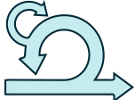

<h3 align="center">
    Hi there, I'm Paola Prada!
  
</h3>
<!-- Social icons -->
<p align="center">
    <a href="https://www.linkedin.com/in/paolapradar/" target="_blank">
        
    </a>
    &#8287;
    <a href="https://youtube.com/c/PaolaPradaR" target="_blank">
        
    </a>
    &#8287;
    <a href="https://gitlab.com/paolapradar" target="_blank">
        
    </a>
    &#8287;
    <a href="https://www.twitter.com/paolapradar" target="_blank">
        
    </a>
    &#8287;
    <a href="https://www.instagram.com/paolapradar" target="_blank">
        
    </a>
</p>

<!-- My current position -->
<p align="center">
  
</p>


### 🤓 About Me

```I am a Full Stack Developer with 9+ years of experience in developing enterprise web applications.```

- 💻 I’m currently working with PHP, Javascript, Postgresql...
- 👩‍💻 Also, I'm managing the projects with SCRUM using Jira.
- 💬 Ask me anything about from [Here](https://github.com/paolapradar/paolapradar/issues)
- 📫 How to reach me: ypprada@gmail.com
- ⚡ Fun fact: 😍🐶 and I've a [Vblog](www.youtube.com/c/viajandoenvacas) ✈️
- 🏠 I love working 100% from home
- 👩 Pronouns: Her

<em>All of my projects are released as closed-source in different platforms, I can't share them for confidentiality reasons in the companies.</em>
<br/><br/>
### 🛠️ My Tools

<details>
    <summary><b> Software Development </b></summary>
    <br/>
    <p>
        <a href="https://www.php.net/" target="_blank">
            
        </a>
        <a href="https://framework.zend.com/" target="_blank">
            
        </a>
        <a href="https://laravel.com/" target="_blank">
            
        </a>
        <a href="https://www.python.org" target="_blank">
            
        </a>
        <a href="https://www.java.com/es/" target="_blank">
            
        </a>
        <a href="https://www.postgresql.org/" target="_blank">
            
        </a>
        <a href="https://www.mysql.com/" target="_blank">
            
        </a>
        <a href="https://www.microsoft.com/es-es/sql-server/" target="_blank">
            
        </a>
        <a href="https://www.sqlite.org/" target="_blank">
            
        </a>
        <a href="https://www.oracle.com/co/" target="_blank">
            
        </a>
        <a href="https://developer.mozilla.org/es/docs/Web/JavaScript" target="_blank">
            
        </a>
        <a href="https://developer.mozilla.org/es/docs/Learn/Getting_started_with_the_web/HTML_basics" target="_blank">
            
        </a>
        <a href="https://getbootstrap.com/" target="_blank">
            
        </a>
        <a href="https://tailwindcss.com/" target="_blank">
            
        </a>
        <a href="https://code.visualstudio.com/" target="_blank">
            
        </a>
        <a href="https://www.sourcetreeapp.com/" target="_blank">
            
        </a>
        <a href="https://dbeaver.io/" target="_blank">
            
        </a>
    </p>
</details>
<details>
    <summary><b> Project Management </b></summary>
    <br/>
    <p>
        <a href="https://www.scrum.org/" target="_blank">
            
        </a>
        <a href="https://www.atlassian.com/es/software/jira" target="_blank">
            
        </a>
        <a href="https://www.atlassian.com/es/software/confluence" target="_blank">
            
        </a>
        <a href="https://discord.com/" target="_blank">
            
        </a>
    </p>
</details>
<br/><br/>

<p align=center>
    🔥 __Motivation is powerful__ 🔥 
 </p>
<!--
Here are some ideas
- 🌱 I’m currently learning ...
- 👯 I’m looking to collaborate on ...
- 🤔 I’m looking for help with ...
-->
